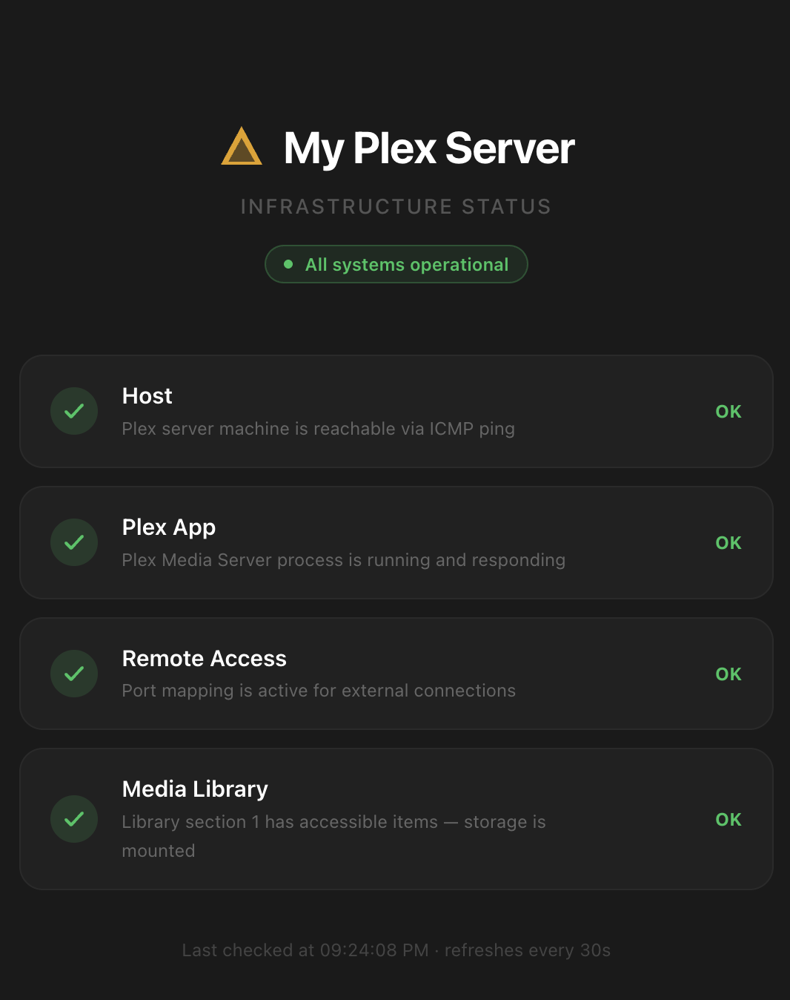

# Plex Status

A simple self-hosted status page for your Plex server. Shows at a glance whether your host, Plex app, remote access, and media storage are all healthy.



## What it checks

| Check | How |
|---|---|
| **Host** | ICMP ping to the server IP |
| **Plex App** | Hits the `/identity` endpoint |
| **Remote Access** | Checks `mappingState` via `/myplex/account` |
| **Media Library** | Checks library section 1 item count — drops to 0 if storage unmounts |

The server caches results for 30 seconds. The page auto-refreshes every 30s. Clients never contact Plex directly.

## Setup

```bash
cp .env.local.example .env.local
```

Edit `.env.local`:

```
PLEX_HOST=192.168.1.25
PLEX_PORT=32400
PLEX_TOKEN=your_plex_token
PLEX_SERVER_NAME=My Plex Server
```

```bash
npm install
npm run dev        # development
npm run build && npm start   # production
```

## License

MIT — do whatever you want with it.
